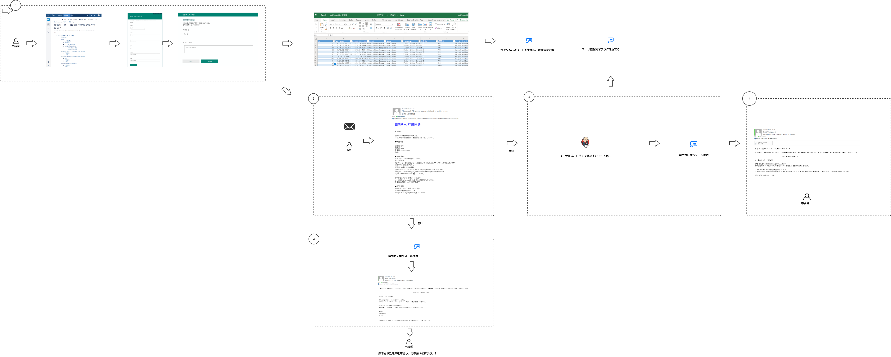

# 概要

自動化プロジェクトの一つになります。  
Jenkinsのjob機能を使用し、サーバ作業とエクセル操作をを自動化し、効率化を行います。

# ツール

今回使用したツールのURLを記載します。

- MS Forms
- Power automate
- OneDrive
- Jenkins

# 申請フロー
実際の画面を使用した申請フローになっています。

# MS Forms

申請者が申請するためのフォームになっています。
申請内容がOneDrive上のエクセル（管理簿）に出力されます。

# Power Automate

申請をトリガーとし、承認、メール通知を一括で管理します。  
Power Automateのフローに各項目の説明していますので、割愛します。  
その他の注意点について説明します。

# パスワード自動生成

ランダムのパスワードはPower Automateの中で実装しています。  
パスワードの文字、数字、記号を配列として定義し、ループで１５文字になるまで変数に追記しています。

パスワードの文字を組み合わせを変更したい場合、辞書の要素を変更してください。

# Jenkinsサーバのジョブ

Jenkinsサーバのジョブとして、サーバ作業を行っています。

# OneDriveの同期

ユーザ追加、ログイン確認後、ローカルにある管理簿にユーザ作成フラグを立てる予定でした。  
しかし、ローカルにある管理簿を更新したのち、OneDriveでサーバ（OFFICE365）にある管理簿を更新する予定でしたが、データ競合が発生してしいます。  
OneDrive上にあるローカルの管理簿を操作することは難しいです。

### Excelのテーブルデータをオブジェクトとして取得する関数

テーブル情報をオブジェクトして取得しています。  
こちらのサイトを参考にしています。  

https://qiita.com/S_SenSq/items/6bae890dbeb47385ea02

## OneDrive

社内サーバが社外のサービスに接続できないため、OneDriveで同期を行い、操作しています。

# 仕様上の注意（使用上の注意）

## MS Formsの出力結果は編集できません。

MS Formsのアンケート結果を出力したものと考えてください。管理簿自体に値を更新する以外の編集はできません。  
MS Formsの申請結果をどこかのデータベースでもっており、それをエクセル（管理簿）に出力しています。 
そのため、列の編集（申請項目の追加、変更、削除）、VBAで何かしらの処理は整合性が合わなくなってしまい、申請結果が管理簿に反映されないことがありました。
